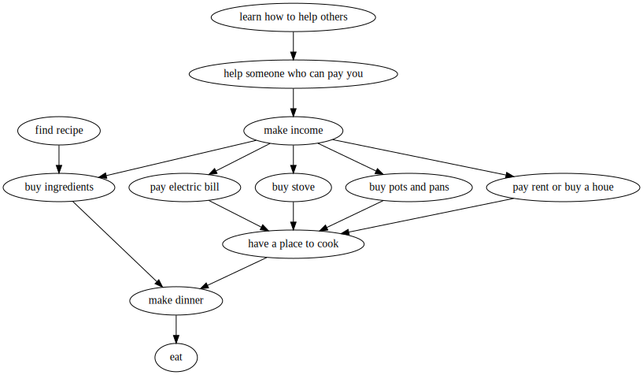

# goalmap

Roadmap and goal mapping tool in Go.  Takes a nested list in markdown format on stdin, spits out a Graphviz dot file on stdout.

Example usage:

```
$ f=examples/food
$ go run main.go < $f.md > $f.dot 
$ dot -Tpdf -o $f.pdf $f.dot
$ evince $f.pdf
```

Example input:
```
- eat                                                                                                                         
  - make dinner                                             
    - buy ingredients                                             
      - find recipe                                                 
      - earn income                                                    
    - have a place to cook                                             
      - pay electric bill                                             
        - earn income                                                                
          - help someone who can pay you                                             
            - learn how to help others                                             
      - buy stove                                                          
        - earn income                                                      
      - buy pots and pans                                                  
        - earn income                                                      
      - pay rent or buy a house                                             
        - earn income                                 
```

Example output:

